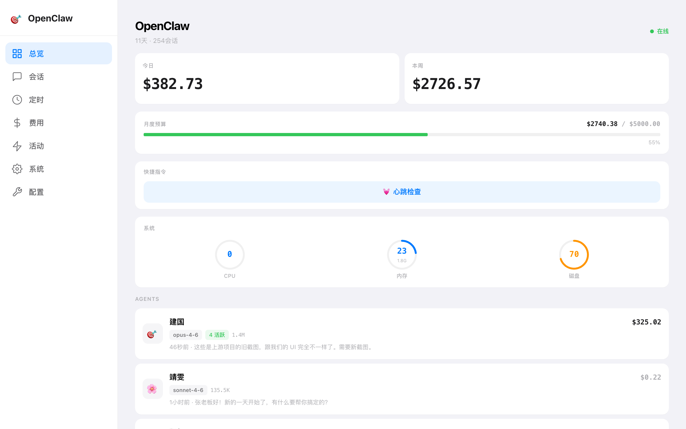
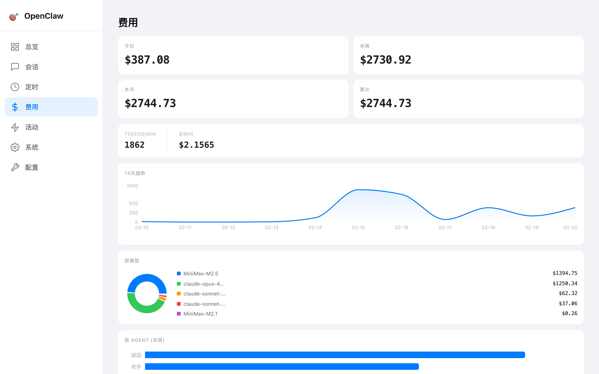
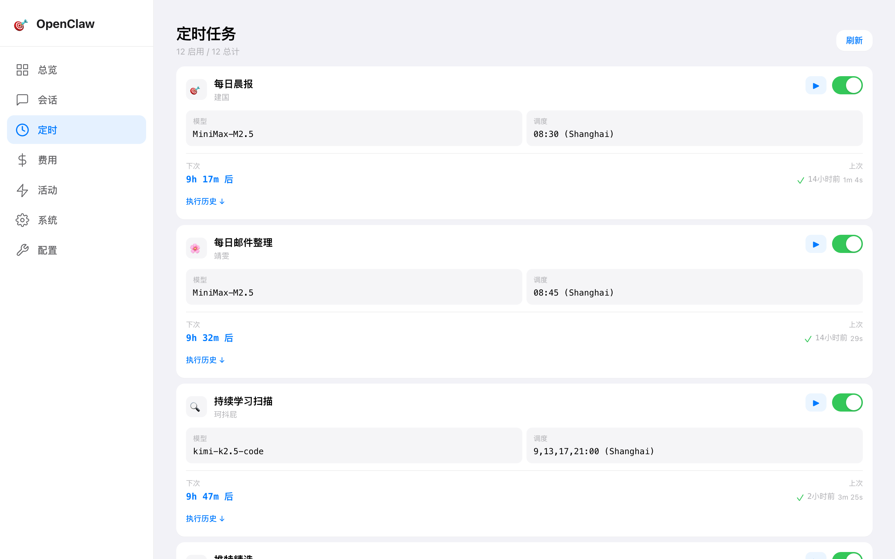
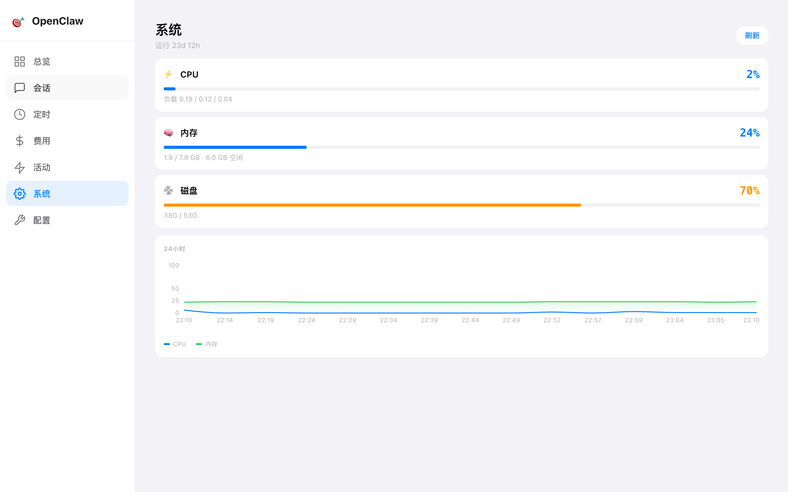
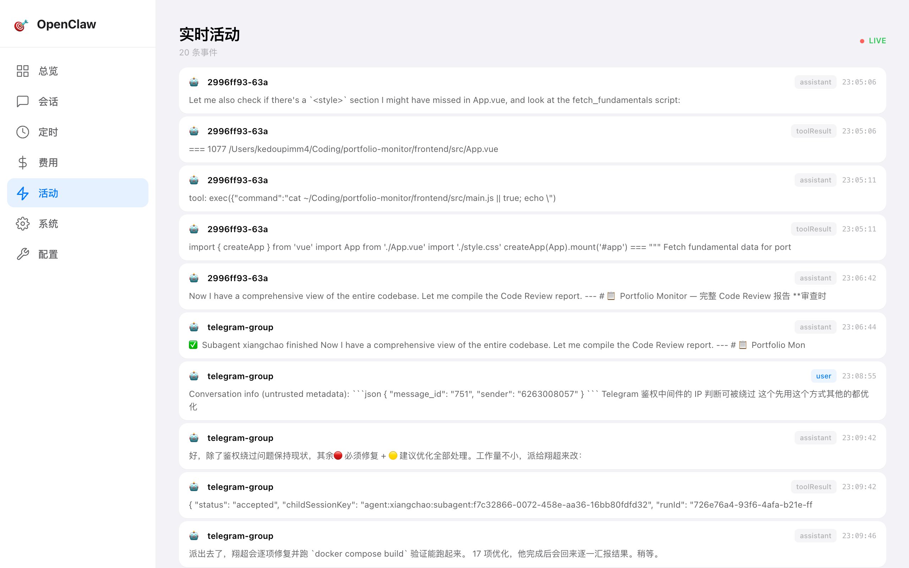
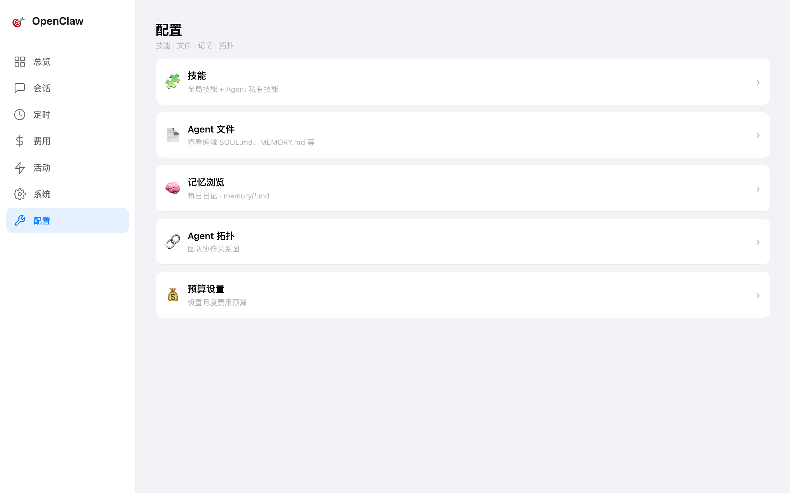
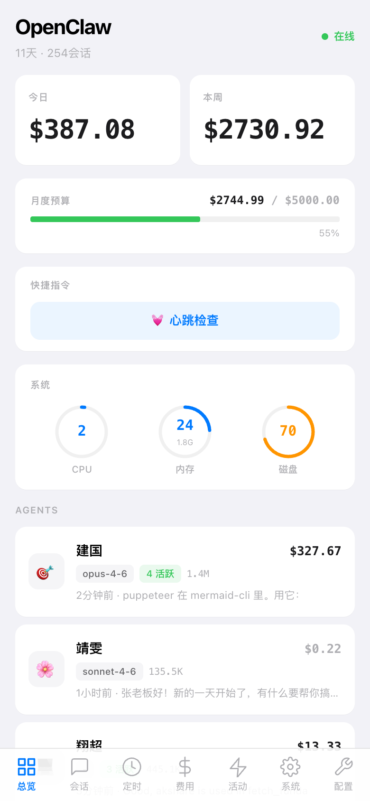

# OpenClaw Mini App

📱 Telegram Mini App dashboard for monitoring and managing [OpenClaw](https://github.com/openclaw/openclaw) multi-agent systems.

[](LICENSE)
[](Dockerfile)

## Screenshots

| Dashboard | Sessions | Costs |
|-----------|----------|-------|
|  |  |  |

| Crons | System | Live Feed |
|-------|--------|-----------|
|  |  |  |

| Config | Mobile |
|--------|--------|
|  |  |

## Features

- **📊 Real-time Overview** — Cost tracking, system health gauges, agent status at a glance
- **💬 Session Monitor** — 100+ concurrent sessions across all agents, with live message preview
- **⏰ Cron Management** — View, toggle, and manually trigger scheduled tasks
- **💰 Cost Analytics** — Breakdown by model, agent, day, and session with budget tracking
- **⚡ Live Feed** — SSE-powered real-time stream of all agent activity
- **🖥️ System Health** — CPU, RAM, disk monitoring with 24h history chart
- **🔧 Config Editor** — Edit workspace files (AGENTS.md, SOUL.md, MEMORY.md, etc.) from browser
- **🤖 Multi-Agent** — Full support for multi-agent setups with per-agent cost breakdown and topology view
- **🌗 Dark Mode** — Auto-detects system/Telegram theme preference
- **📱 Responsive** — Mobile-first Telegram Mini App + desktop sidebar layout

## Quick Start

### Docker (Recommended)

```bash
git clone https://github.com/kedoupi/openclaw-miniapp.git
cd openclaw-miniapp

# Create .env file
cat > .env << EOF
TELEGRAM_BOT_TOKEN=your_bot_token_here
ALLOWED_TELEGRAM_IDS=your_telegram_id
EOF

# Start
docker compose up -d
```

Dashboard available at `http://localhost:8800`

### Manual

```bash
git clone https://github.com/kedoupi/openclaw-miniapp.git
cd openclaw-miniapp
npm install --legacy-peer-deps
npm run build
DASHBOARD_PORT=8800 node server.js
```

## Configuration

### Environment Variables

| Variable | Description | Default |
|----------|-------------|---------|
| `DASHBOARD_PORT` | Server port | `8800` |
| `OPENCLAW_DIR` | OpenClaw config directory | `~/.openclaw` |
| `WORKSPACE_DIR` | Agent workspace path | `$OPENCLAW_DIR/agents/<id>/workspace` |
| `TELEGRAM_BOT_TOKEN` | Bot token for Telegram Mini App auth | — |
| `ALLOWED_TELEGRAM_IDS` | Comma-separated allowed Telegram user IDs | — |

### Docker Compose

```yaml
services:
  dashboard:
    build: .
    container_name: openclaw-dashboard
    ports:
      - "8800:8800"
    volumes:
      - ~/.openclaw:/openclaw:ro
      - ~/.openclaw/agents:/openclaw/agents:rw
      - dashboard-data:/app/data
    environment:
      - DASHBOARD_PORT=8800
      - OPENCLAW_DIR=/openclaw
      - WORKSPACE_DIR=/openclaw/agents/main/workspace  # Change 'main' to your agent ID
      - TELEGRAM_BOT_TOKEN=${TELEGRAM_BOT_TOKEN}
      - ALLOWED_TELEGRAM_IDS=${ALLOWED_TELEGRAM_IDS}
    restart: unless-stopped

volumes:
  dashboard-data:
```

## Authentication

Two access modes:

| Access Method | Auth Required |
|---------------|--------------|
| IP address / localhost | ✅ Direct access, no auth |
| Domain (e.g. via Cloudflare Tunnel) | 🔐 Telegram Mini App verification |

- **IP direct access** — Bypasses auth automatically. Great for LAN/VPN access.
- **Domain access** — Requires opening as a Telegram Mini App. Bot token + user ID whitelist enforced.

### Setting up Telegram Mini App

1. Create a bot via [@BotFather](https://t.me/BotFather)
2. Set the bot's Menu Button URL to your dashboard domain
3. Add `TELEGRAM_BOT_TOKEN` and `ALLOWED_TELEGRAM_IDS` to `.env`
4. Open the bot in Telegram → tap Menu Button → Dashboard loads as Mini App

## Architecture

```
┌─────────────────┐     ┌──────────────────┐
│  Telegram Mini   │────▶│  Dashboard       │
│  App (Browser)   │     │  (Node.js)       │
└─────────────────┘     │                  │
                        │  Reads:          │
┌─────────────────┐     │  - sessions/     │
│  Desktop/Mobile  │────▶│  - openclaw.json │
│  Browser (IP)    │     │  - cron/jobs.json│
└─────────────────┘     │  - workspace/    │
                        └──────────────────┘
                               │ volume
                        ┌──────────────────┐
                        │  ~/.openclaw/     │
                        │  (Host mount)     │
                        └──────────────────┘
```

### Tech Stack

- **Backend**: Node.js, zero runtime dependencies
- **Frontend**: React 19 + Vite + TailwindCSS
- **Auth**: Telegram WebApp `initData` HMAC verification
- **Deployment**: Docker multi-stage build (~50MB image)

## API Endpoints

All `/api/*` endpoints require auth (session token or IP direct access).

| Endpoint | Description |
|----------|-------------|
| `GET /api/sessions` | All agent sessions with token/cost data |
| `GET /api/usage` | 5-hour rolling window usage per model |
| `GET /api/costs` | Cost breakdown by model, day, session |
| `GET /api/costs-by-agent` | Per-agent cost (today/week/total) |
| `GET /api/system` | CPU, RAM, disk, load average |
| `GET /api/crons` | Cron job list with status |
| `POST /api/cron-toggle` | Enable/disable a cron job |
| `GET /api/topology` | Agent relationship graph |
| `GET /api/skills` | Global + per-agent installed skills |
| `GET /api/live` | SSE stream of real-time agent messages |
| `GET /api/health-history` | 24h CPU/RAM history |
| `GET /api/lifetime-stats` | All-time token/cost/session totals |
| `GET /api/budget` | Monthly budget status |

## Container Mode

When running in Docker, host-dependent features gracefully degrade:

| Feature | Container Behavior |
|---------|-------------------|
| Run Cron | Returns 503 (no `openclaw` CLI in container) |
| Trigger Heartbeat | Returns 503 |
| Service Status | Shows "container mode" |
| Session/Cost/Cron Data | ✅ Works via volume mount |
| Config/File Editing | ✅ Works (agents dir mounted rw) |

## Development

```bash
npm install --legacy-peer-deps
npm run dev          # Vite dev server with HMR
node server.js       # API server (separate terminal)
```

## Credits

- Built for [OpenClaw](https://github.com/openclaw/openclaw)
- Original dashboard concept by [tugcantopaloglu](https://github.com/tugcantopaloglu/openclaw-dashboard)

## License

[MIT](LICENSE)
